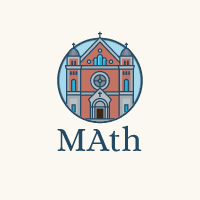

# Matematicas

Repositorio de matematicas, dedicado a la ayuda y el entendimiento de distintas areas dentro de ella

## Contenido
En este repositorio podras encontrar algunas funciones para poder practicar matematicas, como recursividad, entre otras cosas.

- Numeros grandes, revisalo [aqui](https://github.com/mvpsdvlpr/maths/blob/main/bigNum.cpp)

## Run Locally

Clonamos el repo

```bash
$ git clone https://link-to-project
```

Entramos al directorio de nuestro repo

```bash
$ cd <project-url>
```
Luego compilamos nuestro script a utilizar

```bash
$ g++ -o <name-you-want-to-give> script.cpp
```
Finalmente, hacemos correr nuestro script compilado
```bash
$ ./<name-you-want-to-give> 
```
